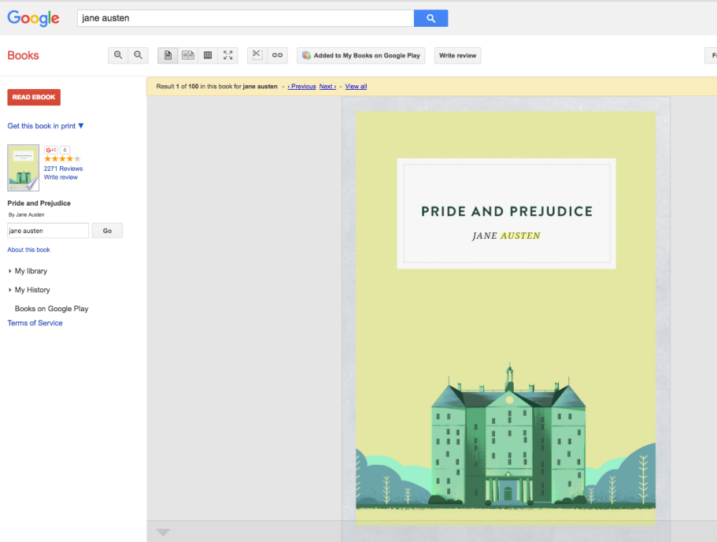
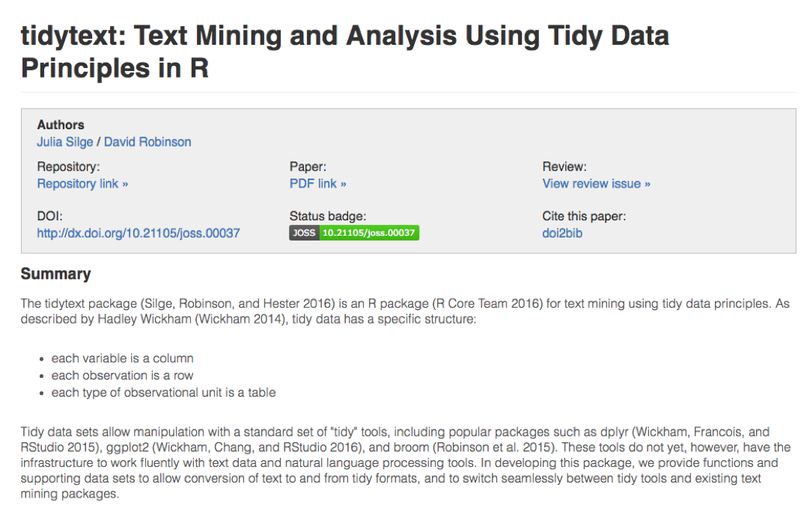
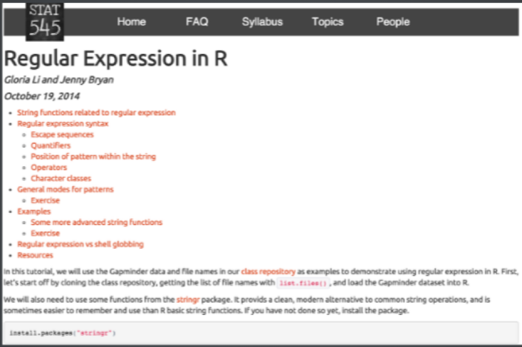

```{r, echo = FALSE, message = FALSE}
library(knitr)
opts_chunk$set(comment = "", cache = TRUE)
library(readr)
library(stringr)
library(tidyr)
library(emo) # hadley/emo
source("../slide_functions.R")
suppressPackageStartupMessages(library(dplyr))
```

## Data Cleaning

In general, data cleaning is a process of investigating your data for inaccuracies, or recoding it in a way that makes it more manageable.

`r emo::ji("warning")` MOST IMPORTANT RULE - LOOK `r emo::ji("eyes")` AT YOUR DATA! `r emo::ji("warning")`

# String functions

## Pasting strings with `paste` and `paste0`

Paste can be very useful for joining vectors together:

```{r Paste}
paste("Visit", 1:5, sep = "_")
paste("Visit", 1:5, sep = "_", collapse = " ")
paste("To", "is going be the ", "we go to the store!", sep = "day ")
# and paste0 can be even simpler see ?paste0 
paste0("Visit",1:5)
```

## Paste Depicting How Collapse Works

```{r Paste2}
paste(1:5)
paste(1:5, collapse = " ")
```

## Useful String Functions

Useful String functions

* `toupper()`, `tolower()` - uppercase or lowercase your data:
* `str_trim()` (in the `stringr` package) or `trimws` in base 
- will trim whitespace on ends
* `stringr::str_squish` - trims and replaces double spaces
* `nchar` - get the number of characters in a string


## The `stringr` package

Like `dplyr`, the `stringr` package:

* Makes some things more intuitive
* Is different than base R
* Is used on forums for answers
* Has a standard format for most functions
* the first argument is a string like first argument is a `data.frame` in `dplyr`


## 'Find' functions: `stringr`

`str_detect`, `str_subset`, `str_replace`, and `str_replace_all` search for matches to argument pattern within each element of a character vector: they differ in the format of and amount of detail in the results. 

* `str_detect` - returns `TRUE` if `pattern` is found
* `str_subset` - returns only the strings which pattern were detected
* convenient wrapper around `x[str_detect(x, pattern)]`
* `str_extract` - returns only strings which pattern were detected, but ONLY the pattern
* `str_replace` - replaces `pattern` with `replacement` the first time
* `str_replace_all` - replaces `pattern` with `replacement` as many times matched

## Let's look at modifier for `stringr`

`?modifiers`

* `fixed` - match everything exactly
* `regexp` - default - uses **reg**ular **exp**ressions
* `ignore_case` is an option to not have to use `tolower`
* `boundary` - Match boundaries between things (e.g. words, sentences, characters).


## Substringing

Very similar:

Base R

* `substr(x, start, stop)` - substrings from position start to position stop
* `strsplit(x, split)` - splits strings up - returns list!

`stringr`

* `str_sub(x, start, end)` - substrings from position start to position end
* `str_split(string, pattern)` - splits strings up - returns list!


## Splitting String: base R

In base R, `strsplit` splits a vector on a string into a `list`

```{r strsplit}
x <- c("I really", "like writing", "R code programs")
(y <- strsplit(x, split = " ")) # returns a list
(y2 <- stringr::str_split(x, " ")) # returns a list
```

## Using a fixed expression

One example case is when you want to split on a period "`.`".  In regular expressions `.` means **ANY** character, so

```{r strsplitfixed}
str_split("I.like.strings", ".")
str_split("I.like.strings", fixed("."))
```

## Use `purrr` or `apply*` to extract from string lists

```{r stsplit2}
sapply(y, dplyr::first) # on the fly
purrr::map_chr(y, nth, 2) # on the fly
sapply(y, dplyr::last) # on the fly
```

## Boundary

We can use `boundary` in the case of `str_split` as well:

```{r}
words <- c("These are   some words.")
str_count(words, boundary("word"))
# split with space
str_split(words, " ")[[1]]
# split between word
str_split(words, boundary("word"))[[1]]
```


## Splitting/Find/Replace and Regular Expressions

* R can do much more than find exact matches for a whole string
* Like Perl and other languages, it can use regular expressions.
* What are regular expressions?
* Ways to search for specific strings 
* Can be very complicated or simple
* Highly Useful - think "Find" on steroids


## A bit on Regular Expressions

* http://www.regular-expressions.info/reference.html
* They can use to match a large number of strings in one statement
* `.` matches any single character
* `*` means repeat as many (even if 0) more times the last character
* `?` makes the last thing optional
* `^` matches start of vector `^a` - starts with "a"
* `$` matches end of vector `b$` - ends with "b"

## Beginning of line with ^

```{r}
x = c("i think we all rule for participating",
      "i think i have been outed",
      "i think this will be quite fun actually",
      "it will be fun, i think")

str_detect(x, "^i think")
```


## End of line with $


```{r}
x = c("well they had something this morning",
      "then had to catch a tram home in the morning",
      "dog obedience school in the morning",
      "this morning I'll go for a run")

str_detect(x, "morning$")
```


## Character list with [ ]

```{r}
x = c("Name the worst thing about Bush!",
      "I saw a green bush",
      "BBQ and bushwalking at Molonglo Gorge",
      "BUSH!!")

str_detect(x,"[Bb][Uu][Ss][Hh]")
```


## Sets of letters and numbers

```{r}
x = c("7th inning stretch",
      "2nd half soon to begin. OSU did just win.",
      "3am - cant sleep - too hot still.. :(",
      "5ft 7 sent from heaven")

str_detect(x,"^[0-9][a-zA-Z]")
```

## Negative Classes

I want to match NOT a `?` or `.` at the end of line (fixed with `[ ]`).
```{r}
x = c("are you there?",
      "2nd half soon to begin. OSU did just win.",
      "6 and 9",
      "dont worry... we all die anyway!")

str_detect(x,"[^?.]$")
```


## . means anything

```{r}
x = c("these are post 9-11 rules",
      "NetBios: scanning ip 203.169.114.66",
      "Front Door 9:11:46 AM",
      "Sings: 0118999881999119725...3 !")

str_detect(x, "9.11")
```


## | means or

```{r}
x = c("Not a whole lot of hurricanes.",
      "We do have floods nearly every day", 
      "hurricanes swirl in the other direction",
      "coldfire is STRAIGHT!")

str_detect(x,"flood|earthquake|hurricane|coldfire")
```


## Detecting phone numbers

```{r}
x = c("206-555-1122","206-332","4545","test")

phone = "([2-9][0-9]{2})[- .]([0-9]{3})[- .]([0-9]{4})"

str_detect(x,phone)
```


## Read in Salary Data
```{r}
suppressMessages({
  Sal = readr::read_csv(
    "https://raw.githubusercontent.com/muschellij2/adv_data_sci_2023/main/example_data/Baltimore_City_Employee_Salaries_FY2014.csv", 
    progress = FALSE)
})
raw_salary_data = Sal
head(Sal)
```

## 'Find' functions: finding values, `stringr` and `dplyr` 

```{r ggrep}
str_subset(Sal$Name, "Rawlings")
Sal %>% filter(str_detect(Name, "Rawlings"))
```

## Replacing and subbing: `stringr` 

We can do the same thing (with 2 piping operations!) in dplyr

```{r orderSal_stringr_rework}
dplyr_sal = Sal
dplyr_sal = dplyr_sal %>% mutate( 
  AnnualSalary = AnnualSalary %>%
    str_replace(fixed("$"), "") %>%
    as.numeric) %>%
  arrange(desc(AnnualSalary))
```

## Showing difference in `str_extract` and  `str_extract_all`

`str_extract_all` extracts all the matched strings
- `\\d` searches for DIGITS/numbers

```{r }
head(str_extract(Sal$AgencyID, "\\d"))
head(str_extract_all(Sal$AgencyID, "\\d"), 2)
```

## 'Find' functions: base R

`grep`: `grep`, `grepl`, `regexpr` and `gregexpr` search for matches to argument pattern within each element of a character vector: they differ in the format of and amount of detail in the results. 

`grep(pattern, x, fixed=FALSE)`, where:

* pattern = character string containing a regular expression to be matched in the given character vector.

* x = a character vector where matches are sought, or an object which can be coerced by as.character to a character vector.

* If fixed=TRUE, it will do exact matching for the phrase anywhere in the vector (regular find)


## 'Find' functions: stringr compared to base R

Base R does not use these functions.  Here is a "translator" of the `stringr` function to base R functions

* `str_detect` - similar to `grepl` (return logical)
* `grep(value = FALSE)` is similar to `which(str_detect())`
* `str_subset` - similar to `grep(value = TRUE)` - return value of matched
* `str_replace` - similar to `sub` - replace one time 
* `str_replace_all` - similar to `gsub` - replace many times

## Important Comparisons

Base R:

* Argument order is `(pattern, x)`
* Uses option `(fixed = TRUE)`

`stringr`

* Argument order is `(string, pattern)` aka `(x, pattern)`
* Uses function `fixed(pattern)`

## 'Find' functions: Finding Indices

These are the indices where the pattern match occurs:

```{r RawlMatch}
grep("Rawlings",Sal$Name)
which(grepl("Rawlings", Sal$Name))
which(str_detect(Sal$Name, "Rawlings"))
```

## 'Find' functions: Finding Logicals

These are the indices where the pattern match occurs:

```{r RawlMatch_log}
head(grepl("Rawlings",Sal$Name))
head(str_detect(Sal$Name, "Rawlings"))
```


## 'Find' functions: finding values, base R 

```{r grepl}
grep("Rawlings", Sal$Name, value=TRUE)
Sal[grep("Rawlings", Sal$Name), ]
```


## Showing differnce in `str_extract`

`str_extract` extracts just the matched string

```{r ggrep2}
ss = str_extract(Sal$Name, "Rawling")
head(ss)
ss[!is.na(ss)]
```

## Showing differnce in `str_extract` and  `str_extract_all`

`str_extract_all` extracts all the matched strings

```{r }
head(str_extract(Sal$AgencyID, "\\d"))
head(str_extract_all(Sal$AgencyID, "\\d"), 2)
```


## Using Regular Expressions
* Look for any name that starts with:
* Payne at the beginning, 
* Leonard and then an S
* Spence then capital C

```{r grepstar}
head(grep("^Payne.*", x = Sal$Name, value = TRUE), 3)
```

```{r grepstar2}
head(grep("Leonard.?S", x = Sal$Name, value = TRUE))
head(grep("Spence.*C.*", x = Sal$Name, value = TRUE))
```


## Using Regular Expressions: `stringr`
```{r grepstar_stringr}
head(str_subset( Sal$Name, "^Payne.*"), 3)
```

```{r grepstar2_stringr}
head(str_subset( Sal$Name, "Leonard.?S"))
head(str_subset( Sal$Name, "Spence.*C.*"))
```

## Replace

Let's say we wanted to sort the data set by Annual Salary:

```{r classSal}
class(Sal$AnnualSalary)
```

```{r orderstring}
sort(c("1", "2", "10")) #  not sort correctly (order simply ranks the data)
order(c("1", "2", "10"))
```

## Replace

So we must change the annual pay into a numeric:
```{r destringSal}
head(Sal$AnnualSalary, 4)
head(as.numeric(Sal$AnnualSalary), 4)
```

R didn't like the `$` so it thought turned them all to `NA`.

`sub()` and `gsub()` can do the replacing part in base R.

## Replacing and subbing 

Now we can replace the `$` with nothing (used `fixed=TRUE` because `$` means ending):

```{r orderSal}
Sal$AnnualSalary <- as.numeric(gsub(pattern = "$", replacement="", 
                                    Sal$AnnualSalary, fixed=TRUE))
Sal <- Sal[order(Sal$AnnualSalary, decreasing=TRUE), ] 
Sal[1:5, c("Name", "AnnualSalary", "JobTitle")]
```

## Replacing and subbing: `stringr` 

We can do the same thing (with 2 piping operations!) in dplyr
```{r orderSal_stringr}
dplyr_sal = Sal
dplyr_sal = dplyr_sal %>% mutate( 
  AnnualSalary = AnnualSalary %>%
    str_replace(
      fixed("$"), 
      "") %>%
    as.numeric) %>%
  arrange(desc(AnnualSalary))
check_Sal = Sal
rownames(check_Sal) = NULL
all.equal(check_Sal, dplyr_sal)
```

## Removing `$` and `,` in Practice

`readr::parse_*` is a number of useful helper functions for parsing columns

```{r parse_number}
head(readr::parse_number(raw_salary_data$AnnualSalary))
raw_salary_data %>% 
  mutate(across(matches("Salary|Pay"), readr::parse_number)) %>% 
  select(matches("Salary|Pay"))
```


```{r setup2, include = FALSE}
folder = "../imgs/tidytext/"
```

# Tidying Text - What about all of Jane Austin's Novels?


## Jane Austin

```{r ja, out.width="70%", echo = FALSE}

```

## Data Available via: `janeaustenr`

Attached with row numbers (by book).

```{r jane_austin_r}
library(janeaustenr)
original_books <- austen_books() %>%
  group_by(book) %>%
  mutate(linenumber = row_number()) %>%
  ungroup()
head(original_books)
```


## TidyText 

```{r tidytext, out.width="70%", echo = FALSE}

```

http://joss.theoj.org/papers/89fd1099620268fe0342ffdcdf66776f


## A nice tutorial

```{r regex_tutorial, out.width="80%", echo = FALSE}

```

http://stat545-ubc.github.io/block022_regular-expression.html


## Large workhorse function: `unnest_tokens`

```{r unnest_tokens}
library(tidytext)
txt = c("These are words", "so are these", "this is running on")
sentence = c(1, 2, 3)
dat = tibble(txt, sentence)
unnest_tokens(dat, tok, txt)
```


## What is tokenization? 

<div style='font-size:30pt'>

> "The process of segmenting running text into words and sentences."

- Split on white space/punctuation
- Make lower case 
- Keep contractions together
- Maybe put quoted words together (not in unnest_tokens)

</p>


## One token per row

```{r tidy_books}
tidy_books <- original_books %>% unnest_tokens(word, text)
head(tidy_books)
```

## Stop words/words to filter

```{r wordcloud, out.width="70%", echo = FALSE}

```

http://xpo6.com/list-of-english-stop-words/

## Stop words/words to filter

```{r}
tidy_books %>% 
  group_by(word) %>% 
  tally() %>% 
  arrange(desc(n))
```


## Stemming

Can use `wordStem` to reduce certain words to their primary stem (e.g. remove gerunds/tense):

```{r}
library(SnowballC)
wordStem(c("running","fasted"))
```


## Filtering with joins

```{r}
head(stop_words)
tidy_books = tidy_books %>% anti_join(stop_words, by = "word")
head(tidy_books)
```


## Example classification

```{r AP}
library(tm); 
data("AssociatedPress", package = "topicmodels")
AssociatedPress
class(AssociatedPress)
head(tidy(AssociatedPress)) # generics::tidy
```


## Compare frequencies: Jane Austin vs. the AP

```{r}
comparison <- tidy(AssociatedPress) %>%
  count(word = term, name = "AP") %>%
  inner_join(count(tidy_books, word, name = "Austen")) %>%
  mutate(AP = AP / sum(AP),
         Austen = Austen / sum(Austen),
         diff = AP - Austen) %>% 
  arrange(diff)
head(comparison)
```


## Bag of words

```{r}
tidy_freq = tidy_books %>% 
  dplyr::ungroup() %>% 
  count(book, word, name = "count")
head(tidy_freq)
```

## Bag of words

`nonum` removes any words that are all numeric (many ways of doing this):

```{r}
nonum = tidy_freq %>% 
  filter(is.na(as.numeric(word)))
head(nonum)
```


## Combine "bags"

```{r}
tidy_ap = tidy(AssociatedPress) %>% 
  rename(book = document, 
         word = term, 
         count = count)
dat = rbind(tidy_ap, tidy_freq) 
head(dat)
```


## Term-document matrices

Make a `DocuemntTermMatrix`/reshape the data:

```{r}
dtm = dat %>% cast_dtm(document = book, term = word, value = count)
inspect(dtm[1:6,1:10])
dtm = as.matrix(dtm)
dtm = dtm/rowSums(dtm)
```

## Classify

Show the similarity (based on count correlations with first document):
```{r, fig.width = 8, fig.height = 5}
cor1 = cor(dtm[1,], t(dtm))[1,]; print(cor1[1:5]);
```

```{r, fig.width = 8, fig.height = 5, echo = FALSE}
plot(cor1)
```

## Classify

We see that there is a large clustering of Austen compared to AP:
```{r Sense_Sensibility, fig.width = 8, fig.height = 5}
cor_ss = cor(dtm["Sense & Sensibility",], t(dtm))[1,]; print(cor_ss[1:5]); 
```

```{r Sense_Sensibility_plot, fig.width = 8, fig.height = 5, echo = FALSE}
plot(cor_ss)
```


## Classify

The max similarity is not symmetrical (closest document/book to document 1 does not have document 1 as its closest document/book):

```{r}
(index <- which.max(cor1[-1]))
cor_ss = cor(dtm[index,],t(dtm))[1,]
which.max(cor_ss[-index]) # not 1!
```

## Sentiment analysis

<font  style='font-size:40pt'>
"I hate this stupid class. But I love the instructor"
</font>


## Sentiment analysis

<font  style='font-size:40pt'>
"I <font color="red">hate</font> this <font color="red">stupid</font> class. But I <font color="blue">love</font> the instructor"
</font>


## Sentiment analysis

<font  style='font-size:40pt'>
"I <font color="red">hate</font> this <font color="red">stupid</font> class. But I <font color="blue">love</font> the instructor"
<br>
"Oh yeah, I totally <font color="blue">love</font> doing coding sessions"
</font>


## Sentiments

```{r bing}
bing <- tidytext::sentiments
head(bing)
(dupes <- bing %>% janitor::get_dupes(word))
```

## Sentiments: A little Tidying

Let's remove those cases that it says these duplicates were positive

```{r}
bing = bing %>% 
  anti_join(dupes %>% filter(sentiment == "positive"))
anyDuplicated(bing$word)
```

## Assigning sentiments to words

```{r ja_tidy}
janeaustensentiment <- tidy_books %>%
  inner_join(bing, by = join_by(word)) %>% 
  count(book, index = linenumber %/% 80, sentiment) %>% 
  spread(sentiment, n, fill = 0) %>% 
  mutate(sentiment = positive - negative)
head(janeaustensentiment)
```


## Plotting the sentiment trajectory

```{r, fig.width = 12, fig.height = 6}
suppressPackageStartupMessages({library(ggplot2)})
ggplot(janeaustensentiment, aes(index, sentiment, fill = book)) +
  geom_bar(stat = "identity", show.legend = FALSE) +
  facet_wrap(~book, ncol = 3, scales = "free_x")
```
